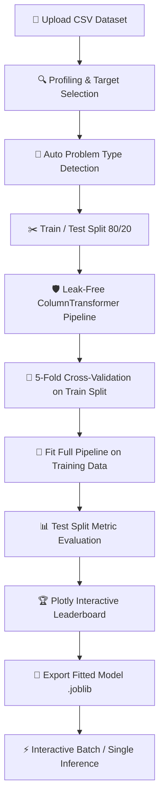

<div align="center">

# ⚔️ Model Arena ⚔️
### *Where Machine Learning Models Compete*

[](https://www.python.org/)
[](https://streamlit.io/)
[](https://scikit-learn.org/)
[](https://xgboost.readthedocs.io/)
[](LICENSE)
[](tests/)

---

**ModelArena** is an automated, production-grade machine learning benchmarking platform for tabular data. Simply upload a CSV file, select your target column, and let ModelArena automatically profile your data, detect the task type, build leak-free pipelines, train multiple ML algorithms, and generate interactive visual leaderboards.

[🚀 Quick Start](#-quick-start) •
[✨ Key Features](#-key-features) •
[🤖 Supported Algorithms](#-supported-algorithms) •
[📊 Workflow Architecture](#-workflow-architecture) •
[📁 Project Structure](#-project-structure)

</div>

---

## ✨ Key Features

- 🧠 **Automated Problem Detection:** Automatically determines whether your target variable requires **Classification** or **Regression** with optional manual overrides.
- 🛡️ **Strict Data Leakage Prevention:** Built with Scikit-Learn `ColumnTransformer` + `Pipeline` architecture to ensure data splitting precedes all scaling, encoding, and imputation.
- 🏆 **Multi-Model Tournament:** Benchmark 6 classification or 6 regression algorithms side-by-side with cross-validation.
- 📈 **Interactive Visual Analytics:** Powered by Plotly — explore confusion matrices, ROC-AUC curves, actual vs. predicted scatter plots, and residual diagnostics.
- 📦 **One-Click Model Export:** Download fitted pipelines as `.joblib` bundles for easy deployment.
- ⚡ **Real-Time Prediction Engine:** Load exported model bundles to generate interactive single-sample predictions or bulk CSV batch inference.
- 🛡️ **Resilient Fault-Tolerant Engine:** Gracefully catches algorithm failures without halting the overall benchmark evaluation.

---

## 🤖 Supported Algorithms

ModelArena compares six top-tier algorithms for each machine learning task:

| 🎯 Classification | 📉 Regression |
| :--- | :--- |
| 🔹 Logistic Regression | 🔹 Linear Regression |
| 🔹 Random Forest Classifier | 🔹 Random Forest Regressor |
| 🔹 K-Nearest Neighbors (KNN) | 🔹 K-Nearest Neighbors Regressor |
| 🔹 Support Vector Machine (SVC) | 🔹 Support Vector Regressor (SVR) |
| 🔹 Decision Tree Classifier | 🔹 Decision Tree Regressor |
| 🔹 XGBoost Classifier | 🔹 XGBoost Regressor |

---

## 🔄 Workflow Architecture



---

## 🛡️ Data Leakage Prevention

Data leakage leads to misleadingly optimistic performance during testing and failure in real-world deployment. ModelArena strictly enforces zero data leakage:

1. **Split-First Policy:** Datasets are split into training (80%) and testing (20%) sets **before** fitting any imputer, scaler, or encoder.
2. **Encapsulated Pipelines:** Preprocessing steps (Median Imputer, Standard Scaler, One-Hot Encoder) are tied directly to estimators using `sklearn.pipeline.Pipeline`.
3. **Cross-Validation Integrity:** `cross_validate` runs the *entire* pipeline inside each fold so parameters are strictly derived from each fold's training split.

---

## 🚀 Quick Start

### 1️⃣ Clone the Repository
```bash
git clone https://github.com/lavbhatia07/Model-Arena-.git
cd Model-Arena-
```

### 2️⃣ Install Dependencies
```bash
pip install -r requirements.txt
```

### 3️⃣ Launch the Application
```bash
streamlit run app.py
```

Open your browser at `http://localhost:8501` and upload sample datasets from the `data/` folder!

---

## 🧪 Running Unit Tests

ModelArena includes a comprehensive test suite covering data profiling, preprocessing pipelines, model registries, leakage prevention, and predictions:

```bash
python -m pytest -v
```

---

## 📁 Project Structure

```text
Model-Arena/
├── app.py                     # Main Streamlit Web Application
├── requirements.txt           # Project Dependencies
├── README.md                  # Documentation & Guide
├── .gitignore                 # Git Exclusions
│
├── core/                      # Core Machine Learning Engine
│   ├── analyzer.py            # Dataset profiling & stats
│   ├── detector.py            # Problem type inference engine
│   ├── preprocessing.py       # ColumnTransformer & Pipeline builder
│   ├── models.py              # Classification & Regression registries
│   ├── trainer.py             # Single model fitting & CV evaluator
│   ├── evaluator.py           # Metric calculation & diagnostic plots
│   ├── benchmark.py           # Multi-model benchmark orchestrator
│   ├── predictor.py           # Inference engine for new tabular data
│   └── model_manager.py       # Model packaging, save & load (.joblib)
│
├── visualization/             # Plotly Visualizations
│   └── charts.py              # Leaderboard, ROC, matrix, residual charts
│
├── utils/                     # Helpers & Data Validation
│   ├── validation.py          # Data schema & target validation
│   └── helpers.py             # Formatting, logging & execution timing
│
├── data/                      # Sample tabular datasets
│   ├── classification_sample.csv
│   └── regression_sample.csv
│
└── tests/                     # Pytest Test Suite
    ├── test_detector.py
    ├── test_preprocessing.py
    ├── test_models.py
    └── test_pipeline.py
```

---
